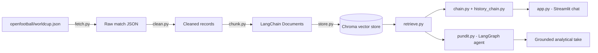

# Pitch-Pundit ⚽

_Grounded FIFA World Cup 2026 Q&A, plus an autonomous agent that writes analytical pundit takes — branded in-app as **Pitch IQ**._

## Overview

Pitch-Pundit is a Retrieval-Augmented Generation (RAG) project built on official World Cup match records, so answers come from real data instead of the model's guesses. It ships two ways to use that data:

- **Pitch IQ Chat** (`app.py`) — a Streamlit chat interface for asking natural-language questions about matches, teams, and results.
- **Pundit Agent** (`pundit.py`) — a LangGraph agent that plans its own retrieval, gathers evidence over multiple steps, and writes a short, source-grounded analytical "hot take" on a given topic — like a sports pundit, but grounded.

## Features

- 💬 **Conversational, history-aware Q&A** — multi-turn chat that keeps context across the conversation
- 🔍 **Grounded retrieval** — answers are built only from indexed match records, not open-ended model knowledge
- 🤖 **Self-directed research agent** — the Pundit Agent decides for itself whether it has enough context or needs another retrieval pass (up to 4 steps), and stops early if a new search stops surfacing new information
- 📚 **Multi-tournament data** — pulls World Cup 2018, 2022, and 2026 records for historical grounding
- 🔌 **Swappable LLM & embedding providers** — Groq or Gemini for chat, Gemini or local Ollama for embeddings
- 🗃️ **Persistent local vector store** — Chroma, so you only pay the embedding cost once

## Architecture



## Tech Stack

| Layer         | Technology                                                                  |
| ------------- | --------------------------------------------------------------------------- |
| UI            | Streamlit                                                                   |
| Orchestration | LangChain, LangGraph                                                        |
| Chat LLM      | Groq (`llama-3.3-70b-versatile`) or Google Gemini (`gemini-2.5-flash`)      |
| Embeddings    | Google Gemini (`gemini-embedding-001`) or Ollama (`nomic-embed-text`)       |
| Vector Store  | Chroma                                                                      |
| Data Source   | [openfootball/worldcup.json](https://github.com/openfootball/worldcup.json) |
| Validation    | Pydantic                                                                    |

## Project Structure

```
Pitch-Pundit/
├── data/
│   ├── raw/            # Cached raw match JSON per year
│   └── chroma/         # Persisted vector store (created on first build)
├── fetch.py            # Pulls World Cup match data from openfootball/worldcup.json
├── clean.py             # Normalizes raw match records
├── chunk.py               # Converts records into LangChain Documents
├── store.py                # Builds / loads the Chroma vector store
├── retrieve.py               # Retriever wrapper over the vector store
├── chain.py                    # Core RAG chain + format_docs helper
├── history_chain.py              # Wraps chain.py with conversation memory
├── pundit.py                       # LangGraph "pundit" research-and-write agent
├── config.py                         # LLM / embedding provider configuration
├── app.py                              # Streamlit chat app ("Pitch IQ — Ask the Tournament")
└── .gitignore
```

## Getting Started

### Prerequisites

- Python 3.10+
- A [Groq API key](https://console.groq.com) (default chat provider) and/or a [Google AI Studio key](https://aistudio.google.com/) (default embeddings, optional chat provider)
- Ollama installed locally if you'd rather run embeddings without a Google key

### Installation

```bash
git clone https://github.com/AtharvaM25/Pitch-Pundit.git
cd Pitch-Pundit

pip install streamlit langchain-core langchain-groq langchain-google-genai \
            langchain-chroma langchain-ollama langgraph pydantic python-dotenv requests
```

### Configure

Create a `.env` file in the project root:

```bash
LLM_PROVIDER=groq          # "groq" or "gemini"
GROQ_API_KEY=your_groq_key

EMBEDDING_PROVIDER=gemini  # "gemini" or "ollama"
GOOGLE_API_KEY=your_google_key
```

> `EMBEDDING_PROVIDER` defaults to `gemini`, so `GOOGLE_API_KEY` is needed even when chatting through Groq — unless you switch it to `ollama`.

### Build the vector store

```bash
python store.py
```

This fetches the 2018, 2022, and 2026 match data, cleans and chunks it, embeds it, and persists it to `data/chroma`.

### Run the chat app

```bash
streamlit run app.py
```

### Run the Pundit Agent

```bash
python pundit.py
```

This runs the built-in example (`topic="France vs Norway"`), streaming each planning/retrieval step before printing a final grounded verdict. To point it at your own topic:

```python
from pundit import build_pundit

agent = build_pundit()
result = agent.invoke({
    "topic": "Your match or storyline here",
    "gathered": [], "next_query": "", "decision": "",
    "steps": 0, "verdict": "", "stalled": False,
})
print(result["verdict"])
```

## Roadmap

- [ ] Surface the Pundit Agent's hot takes inside the Streamlit UI
- [ ] Add source-match links/citations to chat answers
- [ ] Expand beyond World Cup data to club competitions

## Data Source

Match records come from the open-source [openfootball/worldcup.json](https://github.com/openfootball/worldcup.json) dataset.

## Author

**Atharva Mahule**

## License

MIT
