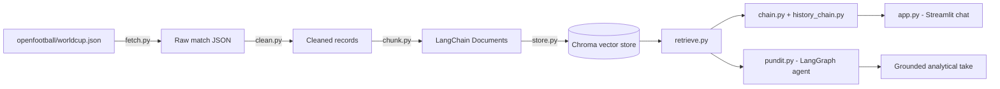

# Pitch Pundit ⚽

_The RAG backend for the Pitch Pundit website. Its Q&A chat feature is called **Pitch IQ** — this repo also includes a second, more autonomous capability._

## Overview

Pitch Pundit is built on official World Cup match records, so answers come from real data instead of the model's guesses. This repo (`Pitch-Pundit` on GitHub) ships two capabilities:

- **Pitch IQ Chat** (`app.py`) — the site's chat feature: a Streamlit interface for asking natural-language questions about matches, teams, and results.
- **Pundit Agent** (`pundit.py`) — a LangGraph agent that plans its own retrieval, gathers evidence over multiple steps, and writes a short, source-grounded analytical "hot take" on a given topic — like a sports pundit, but grounded.

## Design Decisions

- **Honest refusal, enforced in the prompt.** Grounding isn't just the retrieval threshold (`score_threshold=0.5`) — that only filters weak matches before they reach the model. The actual refusal behavior comes from the system prompt in `chain.py`: answer only from the provided match data, say plainly when something isn't in the records, never fall back on the model's own training knowledge. That's why it refuses even on questions the base model could otherwise answer from memory.
- **A fixed chain for chat, a real agent for analysis.** The chat path retrieves once and generates, wrapped with history for multi-turn context. The Pundit Agent is a different shape — a LangGraph loop that plans its own next query, retrieves, and decides for itself whether to keep digging or write up. That's the RAG-vs-agentic distinction, made concrete in two files instead of left abstract.
- **Termination the agent doesn't control.** The agent's own planning step could say "CONTINUE" forever, so the loop is capped by a step counter (`MAX_STEPS = 4`) checked in the routing logic, outside the agent's own decision — plus a stall check that exits early once a new retrieval stops surfacing new information.
- **One env var, not a rewrite.** `LLM_PROVIDER` and `EMBEDDING_PROVIDER` swap between Groq/Gemini and Ollama/Gemini with no code changes. The tradeoff that comes with that flexibility — embedding spaces aren't interchangeable across providers — is documented below, not hidden.
- **Analytical, not a verdict machine.** The Pundit Agent is explicitly instructed to stay analytical and never pass unfounded verdicts — it can tell you Norway conceded six goals in three games, not whether a penalty call was right.

## Features

- 💬 **Conversational, history-aware Q&A** — multi-turn chat that keeps context across the conversation
- 🔍 **Grounded retrieval** — answers are built only from indexed match records, enforced by prompt rules, not open-ended model knowledge
- 🤖 **Self-directed research agent** — the Pundit Agent decides for itself whether it has enough context or needs another retrieval pass (up to 4 steps), and stops early if a new search stops surfacing new information
- 🔌 **Swappable LLM & embedding providers** — Groq or Gemini for chat, Ollama or Gemini for embeddings
- 🗃️ **Persistent local vector store** — Chroma, so you only pay the embedding cost once
- 📅 **Year-parameterized ingestion** — `fetch_worldcup(year)` already works for 2018, 2022, and 2026; only 2026 is indexed into the store today (see [Data Source](#data-source))

## Architecture



## Tech Stack

| Layer         | Technology                                                                   |
| ------------- | ---------------------------------------------------------------------------- |
| UI            | Streamlit                                                                    |
| Orchestration | LangChain, LangGraph                                                         |
| Chat LLM      | Groq `llama-3.3-70b-versatile` (default) or Google Gemini `gemini-2.5-flash` |
| Embeddings    | Ollama `nomic-embed-text` (default) or Google Gemini `gemini-embedding-001`  |
| Vector Store  | Chroma                                                                       |
| Data Source   | [openfootball/worldcup.json](https://github.com/openfootball/worldcup.json)  |
| Validation    | Pydantic                                                                     |

## Project Structure

```
Pitch-Pundit/
├── data/
│   ├── raw/              # cached raw match JSON per year
│   └── chroma/           # persisted vector store (created on first build)
├── fetch.py
├── clean.py
├── chunk.py
├── store.py
├── retrieve.py
├── chain.py
├── history_chain.py
├── pundit.py
├── config.py
├── app.py
├── requirements.txt
├── .env.example
└── .gitignore
```

| File               | Role                                                 |
| ------------------ | ---------------------------------------------------- |
| `fetch.py`         | Pulls match data from `openfootball/worldcup.json`   |
| `clean.py`         | Normalizes raw match records                         |
| `chunk.py`         | Converts records into LangChain `Document`s          |
| `store.py`         | Builds / loads the Chroma vector store               |
| `retrieve.py`      | Retriever wrapper over the vector store              |
| `chain.py`         | Core RAG chain + `format_docs` helper                |
| `history_chain.py` | Wraps `chain.py` with conversation memory            |
| `pundit.py`        | LangGraph "pundit" research-and-write agent          |
| `config.py`        | LLM / embedding provider configuration               |
| `app.py`           | Streamlit chat app ("Pitch IQ — Ask the Tournament") |

## Getting Started

### Prerequisites

- Python 3.10+
- [Ollama](https://ollama.com) installed locally, with the embedding model pulled: `ollama pull nomic-embed-text`
- A [Groq API key](https://console.groq.com) for chat (default provider)
- Optional: a [Google AI Studio key](https://aistudio.google.com/) if you switch `LLM_PROVIDER` or `EMBEDDING_PROVIDER` to `gemini`

### Installation

```bash
git clone https://github.com/AtharvaM25/Pitch-Pundit.git
cd Pitch-Pundit
pip install -r requirements.txt
```

### Configure

```bash
cp .env.example .env
```

Then fill in `.env`:

```bash
LLM_PROVIDER=groq          # "groq" or "gemini"
GROQ_API_KEY=your_groq_key

EMBEDDING_PROVIDER=ollama  # "ollama" or "gemini"
GOOGLE_API_KEY=            # only needed if either provider above is "gemini"
```

> ⚠️ **The vector store and the query-time embedding provider must match.** Embedding spaces aren't compatible across providers — a store built with Ollama embeddings returns nonsense (or fails) if queried with Gemini embeddings, and vice versa. If you change `EMBEDDING_PROVIDER`, rebuild the store: `python store.py`.

### Build the vector store

```bash
python store.py
```

This fetches and indexes World Cup **2026** match data into `data/chroma`. The ingestion pipeline is year-parameterized (`fetch_worldcup(year)`), and 2018/2022 data is already cached in `data/raw/` — see [Roadmap](#roadmap).

### Run the chat app

```bash
streamlit run app.py
```

### Run the Pundit Agent

```bash
python pundit.py
```

This runs the built-in example (`topic="France vs Norway"`), streaming each planning/retrieval step before printing a final grounded verdict. To point it at your own topic:

```python
from pundit import build_pundit

agent = build_pundit()
result = agent.invoke({
    "topic": "Your match or storyline here",
    "gathered": [], "next_query": "", "decision": "",
    "steps": 0, "verdict": "", "stalled": False,
})
print(result["verdict"])
```

## Roadmap

- [ ] Index the already-cached 2018 and 2022 match data into the store for cross-tournament grounding
- [ ] Surface the Pundit Agent's hot takes inside the Streamlit UI
- [ ] Add source-match links/citations to chat answers
- [ ] Expand beyond World Cup data to club competitions

## Data Source

Match records come from the open-source [openfootball/worldcup.json](https://github.com/openfootball/worldcup.json) dataset. The fetch pipeline supports any year in that dataset; the current vector store is built from **2026** only.

## Author

**Atharva Mahule**

## License

MIT
